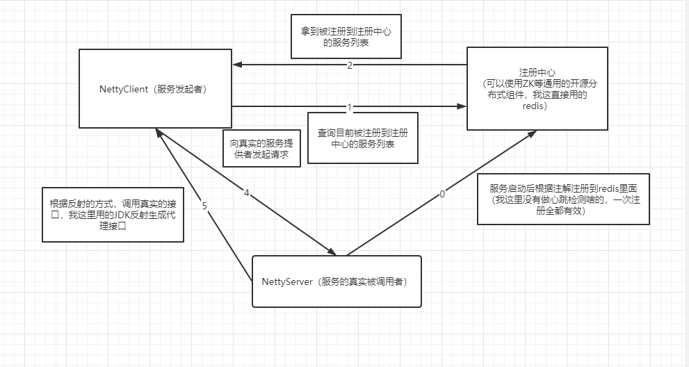

# rpcDemo


###### 1、Server端设计

Server端，我这边是使用的Netty的EventLoopGroup


生成了一个bossGroup负责链接管理，workerGroup负责响应IO事件

在Server这里我重写了ChannelHandler的initChannel处理方法把包括

（1）编码器

（2）解码器 

编码器 解码器我采用的是谷歌的Protostuff方法来进行处理，Protostuff的序列化的效率非常高，也是GRPC的默认的序列化工具，我这里也是跟个风。

（3）事件处理器

事件处理器，通过继承了ChannelInboundHandlerAdapter，在接收到响应事件的时候，根据请求的参数，反射生产类对象。这个就是请求的消息体。

```
public class Request {
    /**
     * 消息管道 不能序列化
     */
    private transient Channel channel;
    /**
     * 请求id
     */
    private String requestId;
    /**
     * 方法
      */
    private String methodName;
    /**
     * 属性
     */
    private Class[] paramTypes;
    /**
     *入参
     */
    private Object[] args;
    /**
     *接口
     */
    private String nozzle;
    /**
     *实现类
     */
    private String ref;
    /**
     *别名
     */
    private String alias;


}

```

根据这些参数，我们反射得到了要调用的类，要调用的方法，根据实际请求参数，调用实际的类

```
Class<?> classType = ClassLoaderUtils.forName(request.getNozzle());
Method addMethod = classType.getMethod(request.getMethodName(), request.getParamTypes());
Object objectBean = applicationContext.getBean(request.getRef());
//通过反射的方式拿到bena代理实现真实的类
Object result = addMethod.invoke(objectBean, request.getArgs());
Response response=new Response();
response.setRequestId(request.getRequestId());
response.setResult(result);
//返回处理结果
ctx.writeAndFlush(response);
```

###### 2、Cilent

Client这边就简单很多了

我们只需要生成一个workerGroup就能处理所有的返回的请求

```
EventLoopGroup workerGroup = new NioEventLoopGroup();
```

```
Bootstrap b = new Bootstrap();
/*
  指定线程池
  指定通道channel的类型，由于是客户端，故而是NioServerSocketChannel；
  初始化服务端可连接队列,指定了队列的大小128
  绑定客户端连接时候触发操作
 */
b.group(workerGroup);
b.channel(NioSocketChannel.class);
b.option(ChannelOption.AUTO_READ, true);
b.handler(new ChannelInitializer<SocketChannel>() {
    @Override
    public void initChannel(SocketChannel ch) {
        ch.pipeline().addLast(
                new Decoder(Response.class),
                new Encoder(Request.class),
                new ClientHandler());
    }
});
//异步获取返回的消息
            ChannelFuture f = b.connect(inetHost, inetPort).sync();
            this.future = f;
            f.channel().closeFuture().sync();
```

###### 3、注册中心

注册中心的选择有很多，带有分布式特性的组件都能使用，我这里是使用的reedis来实现。在Server启动后，我会把所有的的服务注册到redis里面，这里只注册了服务的名称和服务的别名，以及类的全路径（方便反射实现）。

在Client的端口我们就能拿到要调用的的服务了

4、bean管理

我这里直接使用Spring来管理我的Bean